# Terraform Lakehouse Infrastructure as Code (IaC)

## Overview
This repository provides an educational example of how to build an **end-to-end lakehouse architecture** using **Terraform**. The infrastructure includes:

- **Three-tier S3 bucket architecture** (Bronze, Silver, and Gold)
- **Amazon RDS (MySQL)** as the source database
- **AWS Database Migration Service (DMS)** for ingesting changes into S3
- **AWS Glue** for data processing and managing Apache Hudi tables
- **Networking components** including a VPC, subnets, and security groups
- **IAM roles and permissions** for managing resource access
- **Lambda function** to assist with table creation in AWS Glue

> ⚠ **Note:** This repository is **not production-ready** and should be used for **educational purposes** only.

## Architecture
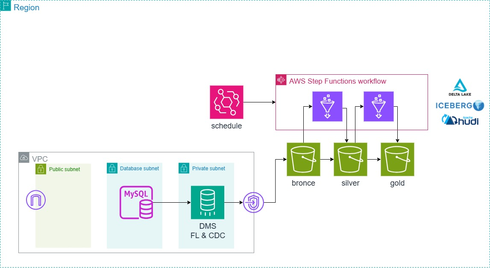

## Prerequisites
Before using this Terraform project, ensure you have:

- [Terraform](https://developer.hashicorp.com/terraform/tutorials/aws-get-started/install-cli) installed
- AWS CLI configured with necessary permissions
- `make` installed to execute the provided **Makefile**
- If you do not have make, just run Terraform commands

## Setup and Usage
### 1. Initialize Terraform
Run the following command to initialize Terraform a local backend:
```sh
make init ENV=dev
```
Run the following command to initialize Terraform an S3 backend:
```sh
make init S3BUCKET=\<my-tf-state-bucket\> ENV=dev
```
### 2. Plan Changes
Check the infrastructure changes before applying:
```sh
make plan ENV=dev
```

### 3. Apply Changes
Deploy the infrastructure:
```sh
make apply
```

### 4. Check Lambda initial configuration
Ther resource `aws_lambda_invocation.initial_configuration` should run the with the `initial_configuration.json` as the payload. This step creates a sample schema, tables, and initial data in **RDS**, which **DMS** will then ingest into the data lake. So check if after the infraestructure was deployed it ran successfully. 
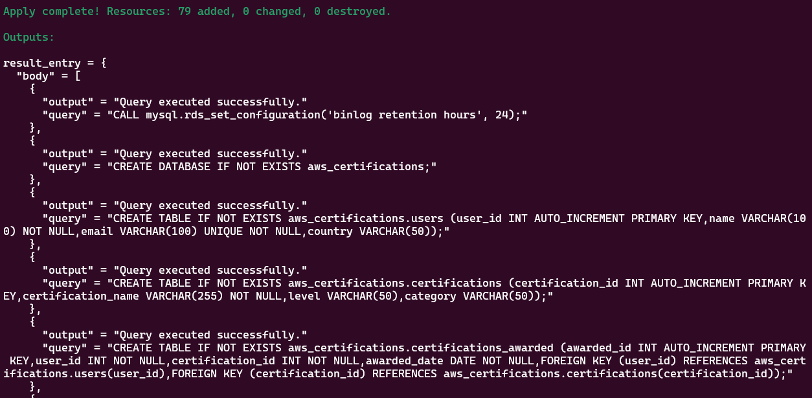

### 6. Initial pipeline run
Run manually the **step functions** pipeline `aws_sfn_state_machine.hudi_fl_cdc_pipeline` (or activate the event bridge schedule `aws_scheduler_schedule.hudi_fl_cdc_pipeline`) in order to:
* Start the **DMS** task.
* Wait for the full load completion.
* Run full load **glue** jobs and therefore create silver tables.
* Run gold etl **glue** job and therefor create the first gold table. 
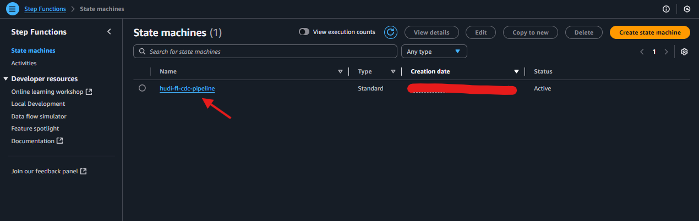
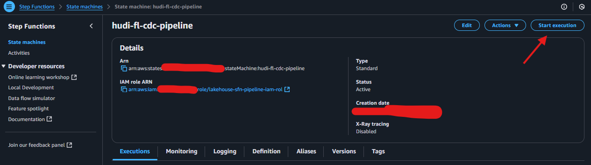
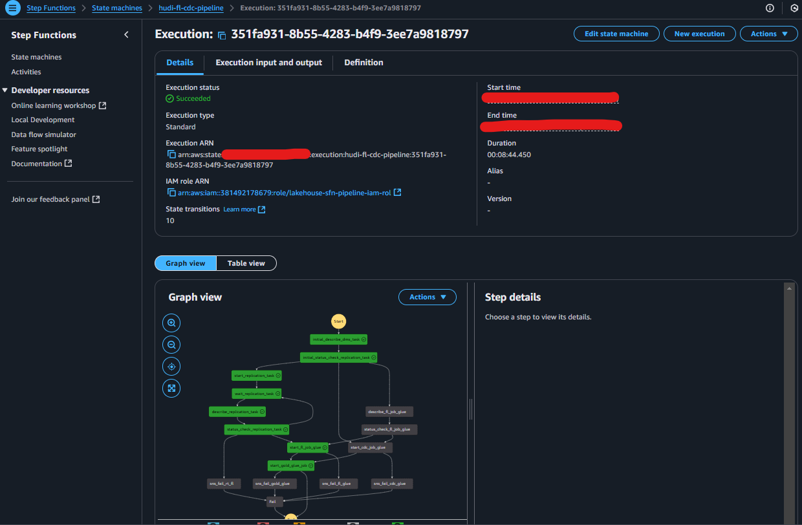
Or
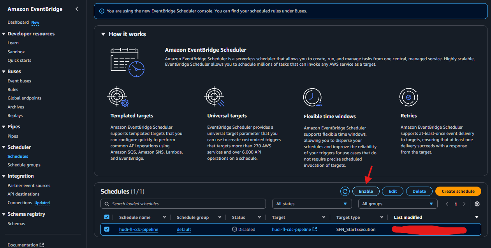
### 7. Verify Data on Athena
Explore the intial load of data using **Athena**.
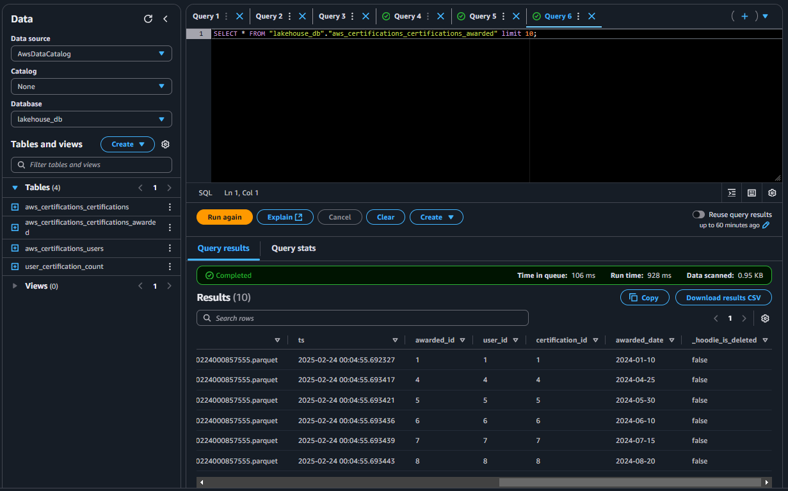
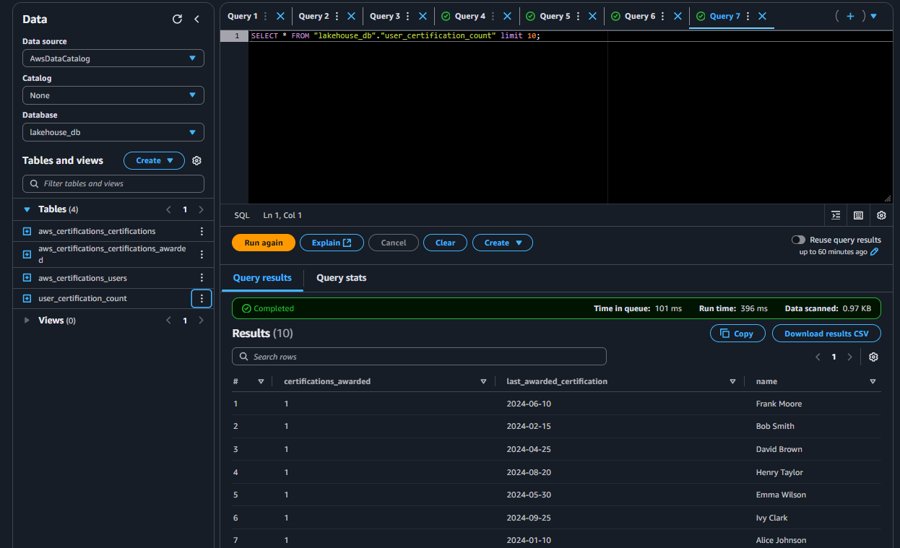
### 8. Apply Upserts on Database
To test change data capture (CDC), run the Lambda function again with `apply_upserts.json`. This applies updates to the **RDS** database, allowing you to observe how **DMS** captures the changes and applies them to **S3** in Parquet format.
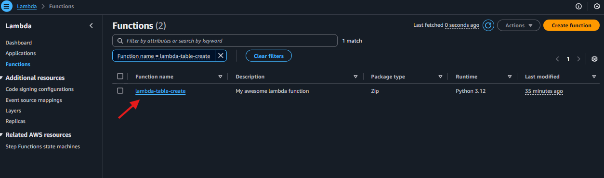
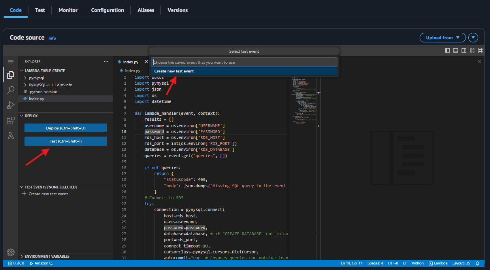
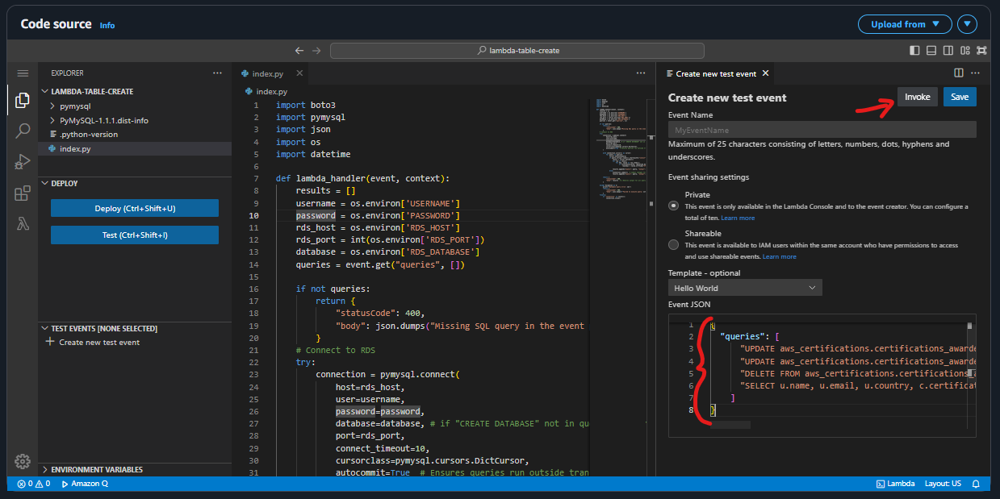
### 9. Verify changes **DMS** and **S3**
To verify the data captured by CDC, check the **S3** buckets for the updated Parquet files.
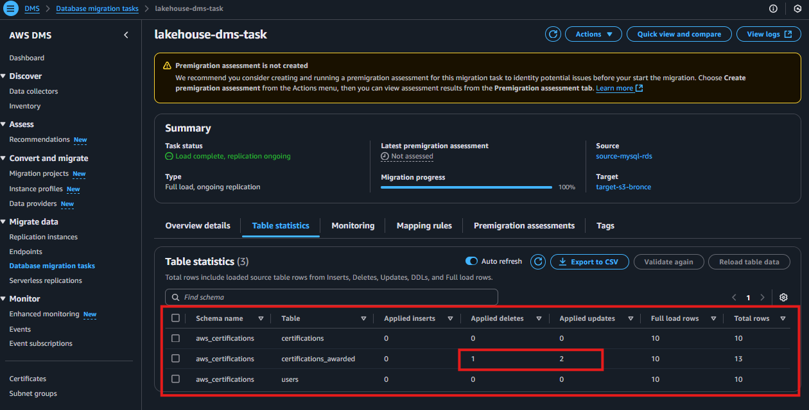
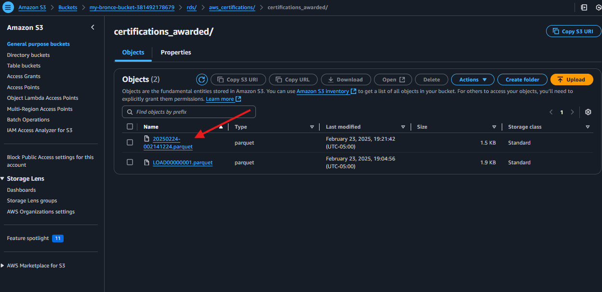
### 10. Apply Upserts on Lakehouse
Once again, run manually the step functions pipeline `aws_sfn_state_machine.hudi_fl_cdc_pipeline` (or activate the event bridge schedule `aws_scheduler_schedule.hudi_fl_cdc_pipeline`) in order to: 
* Run cdc **glue** job and therefore upsert the changes to the silver tables.
* Run gold etl **glue** job and therefore update the gold tables.
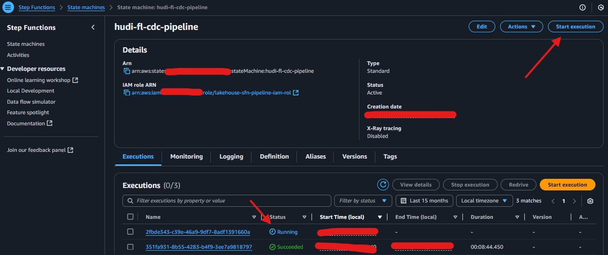
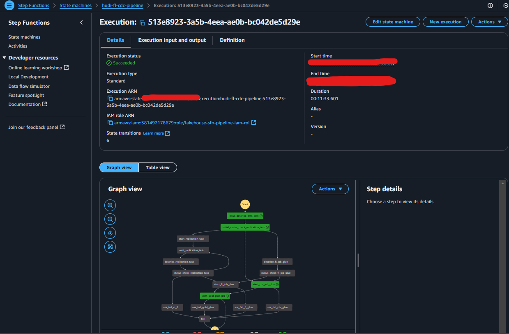
### 11. Verify Data on Athena
Here you can see that the changes were applied by querying `aws_certifications.certifications_awarded` or the `user_certification_count` table.
There should be at least one datapoint deleted.
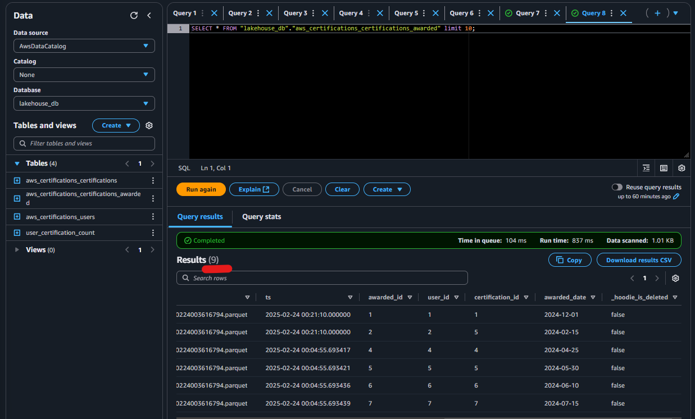
### 12. Destroy Infrastructure
To delete the deployed infrastructure:
```sh
make destroy ENV=dev
```

## Components
### **S3 Data Lake (Bronze, Silver, Gold)**
- **Bronze:** Raw data from source systems (RDS via DMS)
- **Silver:** Cleaned and transformed data
- **Gold:** Final aggregated tables for analytics

### **Amazon RDS (MySQL)**
- Used as the source database for transactional data
- Configured with **binlog format** for Change Data Capture (CDC)

### **AWS DMS (Database Migration Service)**
- Captures changes from MySQL and writes them to S3 in **Parquet format**
- Uses a replication instance to process data migrations

### **AWS Glue & Apache Hudi**
- AWS Glue jobs process data from **Bronze → Silver → Gold**
- **Apache Hudi** enables incremental updates and time-travel queries

### **Networking & Security**
- **VPC with subnets** for RDS, DMS, and Glue
- **Security Groups** control access between services

## Makefile
This repository includes a `Makefile` to simplify common Terraform commands:
```sh
.PHONY: validate init plan apply show graph destroy

.DEFAULT_GOAL := validate

validate:     # Format and validate Terraform files
init:         # Initialize Terraform with S3 backend
plan:         # Show execution plan
apply:        # Apply Terraform changes
show:         # Display current state
graph:        # Generate dependency graph
destroy:      # Destroy Terraform-managed infrastructure
```

## Limitations & Future Improvements
- **Not production-ready:** No monitoring, alerting, or fine-grained IAM policies
- **Manual credentials:** Secrets like database passwords should be managed using AWS Secrets Manager
- **Limited HA:** The architecture does not support high availability configurations

## References
- [Terraform AWS Provider](https://registry.terraform.io/providers/hashicorp/aws/latest/docs)
- [AWS Glue & Apache Hudi](https://docs.aws.amazon.com/glue/latest/dg/aws-glue-programming-etl-format-hudi.html)
- [AWS DMS Documentation](https://docs.aws.amazon.com/dms/latest/userguide/Welcome.html)

---
**Author:** This repository was created to help Data Engineers understand **Lakehouse architectures** on AWS using Terraform.